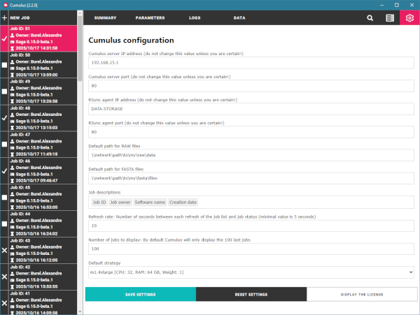
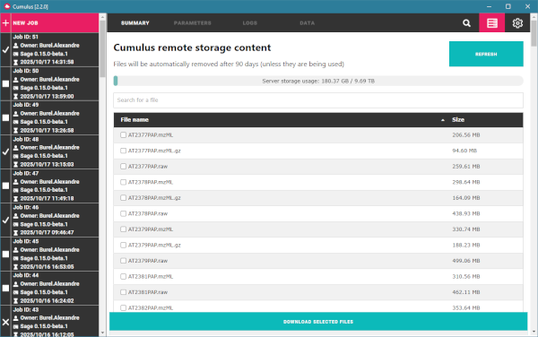
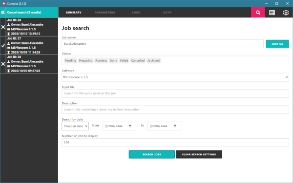
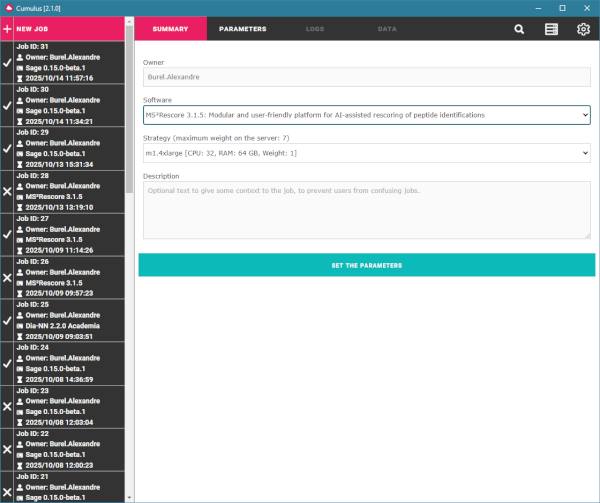
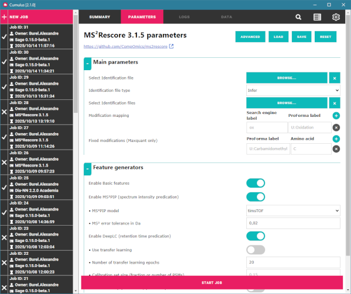
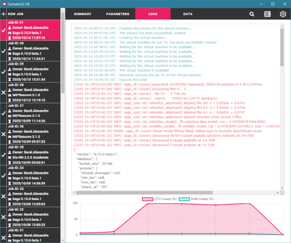
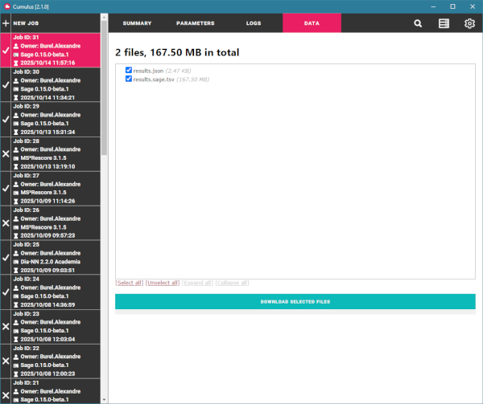
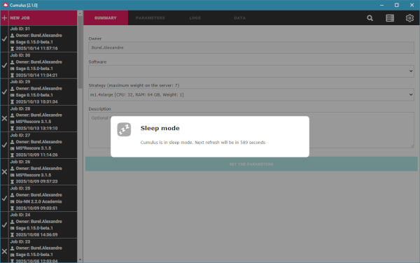

# User documentation

## Main settings

The global settings for the Cumulus GUI can be modified from the application, a button is available in the main banner, under the gear icon.

A series of settings can be modified, although the default values should be fine for all users:

*   Cumulus server IP address
*   Cumulus server port
*   RSync agent IP address
*   RSync agent port
*   Default path for RAW files
*   Default path for FASTA files
*   Job descriptions
*   Refresh rate
*   Number of jobs to display
*   Default strategy

The **server IP address and port** should be provided by the administrator who has set up the server. Same goes for the **RSync agent IP address and port**.

The **default path for RAW/FASTA files** is just the folder that will be opened by default when you browse for RAW data or FASTA files.

The **Job descriptions** indicate what will be displayed for each job in the job list on the left side of the interface. By default, each job will have an icon representing its status, it's identifier, the name of the owner, the selected software name and the creation date.

The **Refresh rate** corresponds to the time in seconds between each call to the server to refresh the job list. The default value is 10 and there is no real reason to change it. A higher value will give the impression that the server is not responding very quickly, but a lower value will just increase the amount to requests to the server, with barely no gain for the user.

The **Number of jobs to display** is the maximum number of jobs in the job list. By default, the list contains the 100 most recent jobs. This allows the requests to the server to remain small and swift. Use -1 to force the server to return all the jobs since the first one.

The **Default strategy** determines which strategy will be selected by default for the creation of a new job. The user should not change this, since the choice of strategy will impact the number of jobs that can be running at the same time. The default strategy already offers enough resources for most cases.

If the user wishes to change the settings, they will have to click on the **Save settings** button to write the new settings into the configuration file. This will restart the Cumulus client.

The default settings are stored in the file "./resources/app/application.conf". The user's settings are stored in "%APPDATA%/Cumulus/cumulus.conf.
This allows to have several users with the same executable, and to make sure that one does not affect the settings of the others.

## Server storage

The user can visualize the RAW files already on the server, using the Storage tab represented by the server icon.

This tab shows the list of files, their size, the total size used on the server and a search bar. There is also a reminder on the lifespan of the files on the server; by default they are deleted after 90 days to avoid saturating the server (this value can be changed in the server configuration file).

Files can be downloaded from here, if can be useful to get the mzML files after they have been converted on the server.

## Search for a job

A search tool is available in the main banner, under the looking glass icon.

This search tool allows the user to search for jobs matching one or more criteria:

*   Job owner: insert a name, or a part of it, to retrieve the matching jobs. A button **Just me** allows to quickly insert your own name, if you want to restrain the search to your own jobs.
*   Status: Filter the results by their status, the user can select as many status as they want.
*   Software: Filter the results by app/version.
*   Input file: Searches for jobs containing at least one file matching the given name. The searched name can be a part of the full file name.
*   Description: Searches for jobs containing the given text in their description.
*   Search by date: Returns the jobs created after a given date, before a given date, or between two dates. The search can be applied to the creation date, start date or end date.
*   Number of jobs to display: by default, only the 100 most recent jobs will be returned.

## Create a new job

The user can open the form to create a new job by clicking on the button **New job**. This is the first button in the job list on the left, the form is also automatically open when Cumulus is started.

This form contains four different tabs, each dedicated to a specific part of the job.

#### Summary tab

The first tab contains the global information of the job:
* The name of the owner: this field is automatically set to the current user's name and cannot be modified.
* Which software and which version the user wants to run. This is the list of apps that the server can execute.
* The strategy required for the job. Each strategy will determine the resources that will be attributed for your job, and each strategy has an associated weight. If the user selects a heavy strategy, it will reduce the amount of possible concurrent jobs. The default strategy is selected, based on which is selected in the application settings.
* The description of the job (optional). The user can use this field to store some contextual information that could be useful for them or their colleagues. For instance, it can be the name of the project, the condition that is being tested, or anything else.

When the software has been selected, the user is invited to **Set the parameters**. A click on this button will open the next tab.

Note: When the job is started, some additional information will be available on the Summary tab:
* The current status of the job.
* The creation date: the date and time when the job is sent to the server's queue.
* The start date: this is when the job is actually being executed, after an eventual waiting time in the queue and the time to create the worker node.
* The end date: this is when the job ends and the output is available.

#### Parameters tab

This tab will be automatically generated depending on the software that has been selected in the Summary tab.

For any software, there will always be the name and the version of the software at top of the page, and if provided a link to the software official page. There are also some buttons that can be helpful:
* Advanced: some apps can have advanced settings that are not visible by default. This button will display the entire list of settings. Note that the button will be disabled if a software does not have any advanced settings.
* Load: let's the user browse for a JSON file containing the settings from a previous job. The settings for this job will be automatically changed with the loaded settings.
* Save: let's the user save the parameters currently displayed into a JSON file. The settings will be kept on the server until the job is deleted, so this option is mostly useful to share the settings to somebody else.
* Reset: removes every change that have been made by the user.

The settings are defined separately for each software/version, in a XML file on the server. This file contains all the details to generate this page on the fly, including the parameters type, the default values, the tooltip texts and the information to execute the job with the chosen parameters.

When the user has set all the settings, a click on the **Start job** button will send the request to the server.

#### Logs tab

When the job is started, the Log tab will be automatically open, with the list of files to transfer to the server. Progression can be followed by the user, with percentages for each file representing the transfer itself. The files who are already on the server will not be transfered again.

Once the files are on the server, the tab will display the text log for the job. This log gathers all the information that is related to the job, with three colors to distinguish them:
*   Server output is written in green. This is for the logs generated by the server, and not by the job. It is used mostly before the job actually starts, for instance when converting the RAW data to mzML or when creating the worker node.
*   Standard output is written in black.
*   Error output is written in red. This is usually a signal for errors and warning, but some applications choose to write their logs on this output.

At the bottom of the tab, a plot represents the percentage of resources consumed by the job. Every 15 seconds while the job is running, the amount of CPU and RAM is retrieved and displayed in this plot. This can be useful if a job crashes because the worker node lacks resources.

#### Data tab

This tab shows the output of a job. It will be empty until the job is finished. Note that a job with a status FAILED may have some output files, but they should be considered with caution.

Click on the **Download** button to transfer the selected output files to your location. By default, all the output files are selected. The files are downloaded one by one, with a progress bar to indicate which file is currently being downloaded.

You can quickly select/unselect all the files. If there are output folders as well, you can quickly expand/collapse them all.

## Clone a preexisting job

Jobs can be cloned very easily: just open any job and you will have a **Clone job** button. This will open a **New job** with the Summary tab and the Parameters tab already filled with the same values as the original job. The identifier of the original job will be added in the description of the new job.

The user can then change any parameter as well as the strategy before starting the job.

## Follow a running job

#### When a job is running, it will go through the following steps:

1.  File transfer: All the files you have selected will be sent to the server. If a file is already present on the server, it will be skipped.
2.  Conversion to mzML (optional): Depending on the app, the RAW data may have to be converted to the mzML format. For the files who have not been converted yet, they are converted at this moment.
3.  Creation of the worker node: Each job is executed on a virtual machine (also called worker nodes), with the resources specified in the strategy selected by the user. **This step take a few minutes**.
4.  Execution of the app on the worker node.
5.  End of the job: The output files are transfered from the worker node to the server.

#### The status of a job will depend on its progression:

*   PENDING: Status for the jobs that have just been created. Jobs are stored in a queue, waiting to be started. The sequence to start new jobs should correspond to their order of creation, but the job can be delayed if the selected strategy requires a large amount of resources.
*   PREPARING: When the job starts, the server will have to execute some tasks before it can properly launch the job. These tasks involve the creation of the worker node on the Cloud, and eventually the conversion of the RAW data to the mzML format.
*   RUNNING: This status indicates that the app of the job is actively running with the user's set of parameters. Users can follow the job progress in the Logs tab.
*   DONE: Status for jobs who ended in success. Users can download the output in the Data tab.
*   CANCELLED: This status can only be obtained when the user chooses to cancel a job. A user cannot cancel somebody else's job.
*   FAILED: Status for jobs who ended in failure. The log may help to see what went wrong.
*   ARCHIVED: The jobs are archived after a number of days (90 by default, it can be changed on the server). Once archived, the output data are deleted but the parameters and logs remain. The status will either ARCHIVED\_DONE, ARCHIVED\_CANCELLED or ARCHIVED\_FAILED, depending on the original status.

#### When the job is done

The output files will be available once the job is finished. A job with a status FAILED may still have output files.

Click on the **Download** button to transfer the selected output files to your location. By default, all the output files are selected.

You can quickly select/unselect all the files. If there are output folders as well, you can quickly expand/collapse them all.

#### Interface refresh

The interface refreshes automatically every 10 seconds (default value). It is refreshed less often if Cumulus is in the background.

After a few minutes of inactivity, Cumulus will go to Sleep mode; a popup will warn the user about it, with the amount to time before the next refresh. A click anywhere on the application will wake it up. The jobs running on the server are not affected by the Sleep mode

## Cancel/Delete a job

There are two constraints to respect to cancel a job:

1.  The user must be the owner of the job
2.  The job must have the status PENDING or PREPARING or RUNNING.

Once a job is stopped (either in success or failure), the user can now only delete it.Be aware that **deletion is permanent**.
